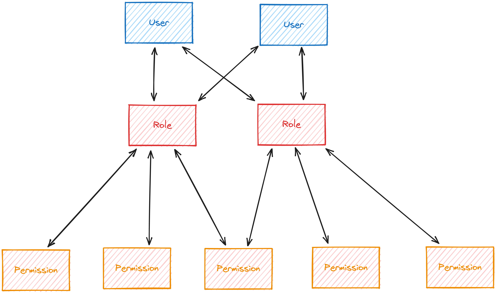

# 🔐 Web Authentication

TODO: Add Intro

## [01. Cookies](./01.cookies/)

1. [Fetchers](./01.cookies/01.fetcher/)
2. [Theme Cookie](./01.cookies/02.theme/)
3. [Optimistic Theme](./01.cookies/03.optimistic-theme/)

Cookies have been an essential part of web browsing since the very beginning of the web. They store small pieces of data on a user's device that is sent to the server which it can then use to facilitate various functions such as maintaining session information, remembering user preferences, and tracking user behaviour.

> **What about GDPR?**
>
> The usage of cookies has evolved throughout the history of the web, and with it comes increasing concerns about data privacy. Regulations such as [GDPR](https://gdpr.eu/what-is-gdpr/) enforce a certain level of standard regarding data privacy and security, and limiting how much of the user's data can be used for tracking purposes. Nowadays, modern browsers provide users with the ability to block or remove cookies from certain websites.
>
> The whole topic of GDPR is fairly broad and beyond the scope of this workshop. Does this mean we should be displaying a GDPR banner on our project? Not for now. In this workshop we'll be focusing mostly on how cookies provide a secure solution for managing user sessions - If you avoid the use of cookies for tracking and advertising purposes, you should generally be fine without a consent banner.

Another common way to store user data in a web application is by using `localStorage`. While using `localStorage` is fine for basic purposes, it does come with a few downsides: Data stored in `localStorage` can be accessed by any script running on the page, and requests to the server do not include data stored in `localStorage`, making it significantly slower as it needs to wait for an additional request to the server before displaying user-specific information.

In this exercise, we demonstrate a basic implementation of cookies by building a theme switcher for the Epic Notes app. On the server side, we use the [`cookie`](https://www.npmjs.com/package/cookie) package to parse and serialize requests containing cookie headers, while on the client side we use Remix's [`useFetcher()`](https://remix.run/docs/en/main/hooks/use-fetcher) hook to make form requests that don't involve a navigation.

We also implement optimistic UI for our theme switcher so that the user can immediately see the change without needing to wait for the server response. We also abstract our implementation into a `useTheme()` hook where we use Remix's [`useFetchers()`](https://remix.run/docs/en/main/hooks/use-fetchers) hook to get the form data from our theme fetcher, which we then use to immediately apply the changes into the UI.

> [!NOTE]
>
> Remix v2.2.0+ makes our `useTheme()` implementation much easier by letting us provide a `key` on our `useFetcher()` call, so we can skip manually finding our theme fetcher from `useFetchers()` and instead use another `useFetcher()` call using the same `key` to get our theme value!

## [02. Session Storage](./02.session-storage/)

1. [Cookie Session Storage](./02.session-storage/01.session/)
2. [Session Set](./02.session-storage/02.set/)
3. [Session Unset](./02.session-storage/03.unset/)
4. [Session Flash Messages](./02.session-storage/04.flash/)

As mentioned earlier, cookies are a great solution for securely managing user sessions. By making use of HTTP-only cookies, we can ensure that important data regarding user authentication cannot be easily modified by client-side scripts. There are multiple attributes we can configure for our cookies, and fortunately Remix also provides some handy utilities to help us quickly set up cookies for our application.

In this exercise, we make use of Remix's [`createCookieSessionStorage()`](https://remix.run/docs/en/main/utils/sessions#createcookiesessionstorage) utility. As the name implies, we can create a session storage using cookies (not to be confused by `window.sessionStorage`) to track the user's session. For now, we use the session storage to implement a flashed toast message whenever the user deletes a note.

Using session storage to display a toast message is relatively straightforward - setting up the `createCookieSessionStorage()` for the toast message gives us `getSession()` and `commitSession()` functions which we can use in other parts of the application. When we want to display a toast message, we pass the cookie header into `getSession()`, `set()` the config object for our toast display, and add a `set-cookie` header with the value returned by `commitSession()` to our `Response`. Then we can call `getSession()` once more in the loader which needs to consume the session value, then `get()` the value we stored in the session object which we can then use in our UI.

We also want to make sure to clear the toast value once we finish displaying it so the user only sees the message once and it disappears after they refresh the page. We can simply `unset()` the toast value after we call the `get()` method, or we can call `flash()` instead of `set()` and it should automatically disappear after the user refreshes the page. Either way, we also need to make sure to call `commitSession()` once again after consuming the value in the loader so that we actually save the cleared toast session.

## [03. User Session](./03.user-sessions/)

1. [Session Storage](./03.user-sessions/01.session/)
2. [Set the userId](./03.user-sessions/02.login/)
3. [Load the User](./03.user-sessions/03.root/)

And now we finally start managing user sessions using the `sessionStorage` utility!

This exercise goes through the exact same steps as the previous exercise, but since we want the user's session data to persist even when the user refreshes the page we don't call `flash()` or `unset()` after consuming the data in the loader.

Using Remix's session storage utilities, we store the user's ID in a cookie (after making sure the user to be logged in actually exists, that is), then we can use the stored ID in a loader to query the user from our Prisma database, after which we can return the user data like usual. We also configured the cookie to be `secure`, so checking the `Application` tab in the DevTools shows us an encrypted value when we try to view the session data we just stored.

## [04. Password Management](./04.password/)

1. [Data Model for Passwords](./04.password/01.schema/)
2. [Seeding Password Hashes](./04.password/02.seed/)
3. [Sign Up](./04.password/03.signup/)

Before we can implement the Login feature, we need to add another field to our `User` model to allow users to input their passwords.

In this workshop, we won't be storing the passwords as plain text - instead we'll store the _hash_ of the passwords to make it a lot harder for malicious attackers from easily gaining access to user accounts. Hashing passwords protects us from [dictionary attacks](https://en.wikipedia.org/wiki/Dictionary_attack), and we'll also add a "salt" to our hashed passwords to protect us from Rainbow Table attacks (where an attacker looks up our hash in a precomputed table of hashes and their inputs). Sounds complicated, but all we'll really be doing is use a library called [`bcryptjs`](https://www.npmjs.com/package/bcryptjs) to generate a salted hashed password when we create user accounts.

To add another layer of security for our passwords, we won't directly store the hashes in the `User` table - Instead, we'll create a separate `Password` table containing our hash and give it a a one-to-one relationship with the `User`. This way, even if another developer accidentally selects the entire `User` table (e.g. by not providing a `select` field in a Prisma db call), the user passwords won't be included on the response.

> [!NOTE]
>
> The lecture notes explains one caveat when using this method for storing passwords:
>
> _"Unfortunately, it's not possible to enforce a required value on both sides of a one-to-one relationship. So we can't enforce that a password is required on the `User` model at the database level. However, it's worth the tradeoff to avoid the risk of leaking passwords. (see this [issue](https://github.com/epicweb-dev/web-auth/issues/7#issue-1912551875) for more information)."_

We also add the password field in our database seed script, creating a reusable utility function for hashing a given password string (or a randomized string as a default).

Finally, 🧝‍♂️ Kellie also implemented the session logic for the `signup` route using a similar flow as the `login` route, so all that's left to do is read the user's `password` input from the form data and store it as a salted hash using `bcryptjs`. We also make sure that the `bcryptjs` module won't be included in the client bundle by re-exporting it from a server-only module file.

## [05. Login](./05.login/)

1. [Login](./05.login/01.login/)
2. [UI Utils](./05.login/02.ui-utils/)

With the changes we've made to our Prisma schema, we can finally implement a Login functionality to our project!

In this exercise, we use `bcrypt` to compare the user's submitted password with the hash that's stored in the database. From there it's simply a matter of adding another error message when the password don't match, which is trivial with the validation setup we currently have.

> [!NOTE]
>
> We also briefly discuss _timing attacks_, where a malicious user can measure the response time for each request and compare these timings to determine whether a username is registered or not. Because the `bcrypt.compare()` function we're using is supposed to be slow, the response for a registered user will take much longer than a nonexistent user (because we immediately throw the error message in that case). For our app, this vulnerability doesn't matter much (all users are publicly visible anyway), but for other apps that require a much stricter security, you might want to look into randomizing response times to help against these kinds of attacks!

We also make some changes to our project's UI to reflect the currently logged in user, if any. Using Remix's [`useRouteLoaderData()`](https://remix.run/docs/en/main/hooks/use-route-loader-data), we can get the user data from the root loader, then use that data to compare the owner IDs in the notes and profile pages. With that, we can now make sure that users can modify/delete only their own notes, and they can't add notes for other users (at least on the client side, we'll get to validating ownership on the server side later!)

## [06. Logout and Expiration](./06.logout/)

1. [Logout](06.logout/01.logout/)
2. [Expiration](./06.logout/02.expiration/)
3. [Deleted Users](./06.logout/03.deleted/)
4. [Automatic Logout](./06.logout/04.auto-logout/)

Now that we can properly handle user sessions to let the user log in and sign up, we can start working on letting the users log out.

The basic logout feature is fairly trivial - all it takes is a `POST` request to `/logout`, where the `action()` simply calls `destroySession()` and sets a new `set-cookie` header to remove the user's session. We can also add an `expires` option to the user's session upon signup/login and it will also automatically remove the session after the time we set has passed. You know the `Remember Me` checkbox you almost always see in various signup/login forms? This is basically the main logic of what they do!

We can also add another layer of security/error handling to our project by verifying if the `userId` in the user session matches an existing user in our database. In case there's a `userId` already set but no matching user in the database, something may have gone wrong with the user's session data (or maybe the user was deleted from the database for some reason). Either way, we simply force a logout and redirect, then the user can try to login again to try and get a correct user session!

We can also play around with this force logout functionality by implementing an auto-logout feature that triggers after a set amount of time. We simply wrap the `POST` request to `/logout` within a `setTimeout()` and reset it as the user keeps using the app, and display a warning modal to the user before the `POST` fires off and automatically logs them out! We probably won't be using this kind of feature in our project moving forward, but for other applications where user data may be more sensitive, this might be a good feature to have on our toolset!

## [07. Protecting Routes](./07.protecting-routes/)

1. [Require Anonymous](./07.protecting-routes/01.anonymous/)
2. [Require Authenticated](./07.protecting-routes/02.authenticated/)
3. [Require Authorized](./07.protecting-routes/03.authorized/)
4. [Redirect from Login](./07.protecting-routes/04.redirect/)

We can now start protecting our routes using the data from the user session! In this exercise, we write reusable utility functions in our `auth.server.ts` to require certain states depending on the user session:

- `requireAnonymous()` - Ensures we don't have an active user session. Otherwise, redirect to the home route.
- `requireUserId()` - Ensures we _do_ have an active user session. Otherwise, redirect to the login route. Later on, we also provide an additional functionality to redirect the user back where they were upon logging in.
- `requireUser()` - Building from `requireUserId()`, gets the `id` and `username` of the currently active user. Automatically logs out if the user session does not have a matching id in the database.

We use these utilities throughout our application to ensure that users do not navigate to or perform actions on routes that they're not allowed to. Because most of the logic is contained within the utility functions, most of the changes in the affected routes typically involve less than 5 lines of code each!

## [08. Role-Based Access](./08.permissions/)

1. [Roles Schema](./08.permissions/01.schema/)
2. [Roles Seed](./08.permissions/02.seed/)
3. [Delete Note](./08.permissions/03.delete-note/)
4. [Permissions Utils](./08.permissions/04.utils/)

Most web applications have to deal with managing different levels of access for different kinds of users. Each user can be assigned their own set of permissions to allow them to perform actions where security is crucial (e.g. regular users can edit/delete only their own content, admins can edit/delete other users' content, etc.). A simple way to do this is to add a permissions field directly to the `User` model, but this can make it more difficult to change permissions for a large number of users later on (perhaps to comply with certain requirements or regulations). What we'll be doing in this exercise is create a separate `Role` model with pre-assigned `Permission`s, then we simply assign specific role/s to the users. Later on, if we have to add/remove/change permissions, we can simply edit the permissions on one `Role` then the change can propagate to all users with that role. This is called [**Role-Based Access Control (RBAC)**](https://auth0.com/intro-to-iam/what-is-role-based-access-control-rbac).

First, we add the `Role` and `Permission` models in our Prisma schema. The `Role` model has the usual fields like `id`/`createdAt`/`updatedAt`, a `name` and `description`, and relationships with `Permission`s and `User`s. The `Permissions` model has the same usual fields, a `description`, a relationship with `Role`s, and three string fields for `action`, `entity`, and `access`. We also set a compound unique constraint for these three string fields because we'll be combining them to get the full permission string like `update:note:own`. For more details on how we're using permissions, feel free to check out the `prisma/schema.prisma` and `app/utils/permissions.ts` files!

With the new models set up, we also update our seed script to add the newly created roles and permissions to our generated users. We also need to manually seed initial values for the roles and permissions so that the production database can also apply them when creating new users. After manually updating the migration file with our manual seed values, we also edit our seed script and reset our local dev database with new users with correct roles and permissions.

To see our RBAC implementation in action, we update our delete note feature to check if the currently logged in user has the required permissions to delete the note. For the owner of the note, we check for the `delete:note:own` permission, while for other users (like admins) we'll check for the `delete:note:any` permission instead. We also throw an error message if the logged in user doesn't have the correct permissions which are then easily handled by our `<errorBoundary />`.

Finally, we extract the common logic for checking permissions into separate utility functions then replace our previous implementation to use the new utility functions instead. We also wrap up the exercise by adding permission checking to other routes such as `/admin`.

## [09. Managed Sessions](./09.managed-sessions/)

1. [Sessions Schema](./09.managed-sessions/01.schema/)
2. [Auth Utils](./09.managed-sessions/02.auth-utils/)
3. [Session Cookie](./09.managed-sessions/03.session-cookie/)
4. [Delete Sessions](./09.managed-sessions/04.delete-sessions/)

In this exercise, we make the user session model a bit more sophisticated by adding the ability to manage multiple sessions across multiple devices.

First, we update our Prisma schema to add a new `Session` model, which we'll then use to update our auth utility functions to keep track of individual sessions instead of users. We also store the `expirationDate` in these session fields, so we can automatically invalidate the session once the session passes its set expiration date. Finally, we also display how many active sessions there are using Prisma's `_count` utility, and add a new feature to let the user sign out all other sessions using `deleteMany` and filtering out the current active session which we'll keep signed in.

## [10. Email](./10.email/)

1. [Resend](./10.email/01.resend/)
2. [Mocks](./10.email/02.mocks/)
3. [Send Email](./10.email/03.send/)
4. [Pass Data Between Routes](./10.email/04.session/)

In this exercise, we set up one of the more essential steps for user verification: sending emails! Emails are one of the steps we can't totally skip in the verification process - it's one of the first steps a user will usually go through when creating new accounts, resetting passwords, and other tasks that require the user to verify their identity. Thus, we'll want to make sure we have a reliable process for sending emails to the user before we move on to adding more advanced steps for user authentication!

There are many ways to programatically send emails to users, but for the sake of both convenience and reliability, we'll use a service called [Resend](https://resend.com/) to handle most of the email deliverability stuff in this exercise (You can definitely try to set up your own email service yourself if you want, but email services ensure that the emails you send are actually going to be seen by your users and not going to their spam folders. [Sadly, the oligopoly has won 😅](https://cfenollosa.com/blog/after-self-hosting-my-email-for-twenty-three-years-i-have-thrown-in-the-towel-the-oligopoly-has-won.html))

> [!IMPORTANT]
>
> Although this exercise's topic covers using Resend to send verification emails, we're not actually going to sign up for a Resend account in this workshop. Instead, we'll set up mocks to simulate the Resend API for local development. You'll still need to sign up for a Resend account later to get a real API key once you have a deployed version of the app!

For local development purposes, we'll also set up mocks for the email service using [Mock Service Worker (MSW)](https://mswjs.io/). This might feel like too much of a boilerplatey setup at first, but seting up mocks this way allows us to test the email verification flow in local development without using up the free tier of our email service too quickly! Fortunately, since we're using [Resend's REST API](https://resend.com/docs/api-reference/emails/send-email) to send the emails, we can use MSW to intercept the request during development and mock up the expected results without changing the actual authentication flow in our app.

We also set up a new `/onboarding` route to handle the next step after the user clicks the verification link sent to their email address. This requires us to have some way of passing data between multiple routes (or multiple tabs in this case, because our user has to navigate to their email to view the verification link and then back to our app to handle the next step of the signup flow). Turns out cookie sessions are a great way of handling this, but we'll want to create a short-lived `verifySession` specific to this onboarding process. In this exercise, we'll only make sure that we're properly setting up the `verifySession` from the `/signup` route (which now only has an email address input) and consuming it within the new `/onboarding` route which has the rest of the signup form fields. We'll handle the actual email verification process next exercise!

## [11. Verification](./11.verification/)

1. [Verification Schema](./11.verification/01.schema/)
2. [Generate TOTP](./11.verification/02.totp/)
3. [Verify Code](./11.verification/03.verify-code/)

Now that we've set up both ends of our new signup flow, let's add the actual verification to ensure that the user who signs up actually owns the email address they used to sign up. We'll be using our email setup from the previous exercise to actually send verification codes to the user's email address, which they'll use to proceed to the next step of the onboarding process. For this exercise (and the later exercises in this workshop that also deal with verification), we'll be using Time-based One-Time Passwords (TOTP) via the [`@epic-web/totp`](https://github.com/epicweb-dev/totp/) package.

First, we'll create a new `Verification` model in our Prisma schema to represent verification sessions. The model stores the various config options used to generate and verify the codes via `@epic-web/totp`, the verification `target` (e.g. a user's email, username, id, etc.), the verification `type` (what the verification is for, like onboarding/password reset/2FA/etc.), and an `expiresAt` time to determine when it's safe to delete the verification.

Once our new model is set up, we can finish wiring up the first step of the signup process to generate the TOTP code we'll send for the verification email. For the email verification code, we'll move a bit away from the default configs and set a `period` of 10 minutes and use the SHA256 `algorithm` to generate the TOTP. After generating the TOTP, we'll also save the verification to our database and redirect the user to the newly created (Thanks 🧝‍♂️ Kellie!) `/verify` route where the user can input the verification code we just sent to their email.

Once that's done, we'll finish up the code verification logic in the `/verify` route. We'll retrieve the verification from the database and use the configs to verify the code the user has submitted. If the submitted code is valid, we have confirmed the user's ownership of the email address and now we can safely delete the verification from the database and redirect the user back to the next step of the onboarding process.

## [12. Reset Password](./12.reset-password/)

1. [Handle Verification](./12.reset-password/01.handle-verification/)
2. [Reset Password](./12.reset-password/02.reset-password/)

With our verification flow set up, we can use the same logic to verify the user's identity in other important routes. Helpfully, 🧝‍♂️ Kellie has extracted out some of the code we wrote in the previous exercise into separate functions to make it easier to reuse the same logic in different verification flows. in this exercise, we'll use these new functions to add a verification check between the `/forgot-password` and `/reset-password` routes.

With the way our `/verify` route is set up, we have a `switch` block to call different functions that handle each of the possible verification `type`s. Thus we can simply add `"reset-password"` to the list of possible `type`s and write another function to handle verifications for our `/reset-password` route. As for the `target`, we'll let the user provide either their username or their email address.

After we've verified the user successfully, we'll finish implementing the main logic for resetting the user's password. This is simply a matter of updating the database with the new password the user has submitted. Since we're using cookies to store the verification data, we can secure this process even more by making sure we have a successful user verification data stored in the cookie before we let their user change their password!

## [13. Change Email](./13.change-email/01.totp/)

1. [Generate TOTP](./13.change-email/01.totp/)
2. [Handle Verification](./13.change-email/02.handle-verification/)

We can also use our `/verify` route setup to verify the user's identity before letting them change their email address. Again, since we've already extracted this logic into reusable functions, we can simply add another `type` to the list and write up another `handleVerification()` function containing the verification logic for the `/settings/profile/change-email` route.

The implementation for the `handleVerification()` is a bit different this time however, since the email changing logic is happening all in the `/settings/profile/change-email`. So we'll `prepareVerification()` once the user submits their new email address, redirect to `/verify` after sending the verification email, verify the code the user submits, then perform the actual email change within `handleVerification()` before redirecting the user back to `/settings/profile`.

## [14. Enable Two Factor Auth](./14.enable-2fa/)

1. [Create Verification](./14.enable-2fa/01.create/)
2. [QR Code](./14.enable-2fa/02.qr-code/)
3. [Verify Code](./14.enable-2fa/03.verify/)

Two-Factor Authentication (2FA) is an increasingly popular way to secure a user's account even more. In addition to requiring the user's username/email and password, it adds an additional step that requires the user to enter another code (usually generated from another device) to verify their identity before successfully logging in. Essentially, this uses the same logic as our TOTP verification steps to prevent malicious users from signing into an account they don't own even if they somehow correctly input their victim's username/email and password.

We've already set up the main part of the verification flow in the previous exercises, but this time we'll use the default 30-second expiration `period` when generating TOTPs and we'll also let the user use their own 2FA authenticator app instead of sending the codes via email. These 2FA verifications also won't have an expiration time, instead it'll stay active as long as the user has enabled 2FA in their profile settings.

For this exercise, we'll focus on initializing the 2FA verification when the user enables in their profile settings. One interesting part of this exercise is that we'll set up a temporary `2fa-verify` verification where we require the user to connect with their 2FA authenticator app for generating TOTPs. We'll be using the same `@epic-web/totp` package to generate the initial TOTP and the auth URI, and we'll also generate a QR code containing the auth URI for the user's 2FA authenticator app to scan. Once that's done, we'll also verify that everything is working by having the user input the generated TOTP from their 2FA authenticator app, verify it on our end, and only then can we safely create the `2fa` verification object which we'll use again the next time the user logs in.

## [15. Verify 2FA Code](./15.verify-2fa/)

1. [Unverified Session](./15.verify-2fa/01.unverified/)
2. [Handle Verification](./15.verify-2fa/02.verify/)

Now that we've enabled 2FA authentication in the user's profile settings, the user will be prompted to enter the verification code from their 2FA verification app every time they log in. In this exercise, we'll wire up the actual logic to verify the 2FA verification codes, and we'll also change the login flow a bit to account for this extra 2FA verification step.

First, we'll adjust the `/login` route's logic a bit to check if the user has 2FA enabled. If they don't, we'll simply proceed as we've done before, but if they _do_ have 2FA enabled, we'll create an unverified session before redirecting the user to `/verify` where they'll input the verification code from their 2FA verification app.

In the `/verify` route, we'll simply add another verification `type` and write another `handleVerification()` function from the `/login` route. After verifying the code, `handleVerification()` will upgrade the user's session from `verifySession` into the `cookieSession` cookie we've been using. Also, we'll skip deleting the user's `verification` object since it still needs to be used every time the user logs in with 2FA enabled.

## [16. Disable Two Factor Auth](./16.2fa-check/)

1. [Delete Verification](./16.2fa-check/01.delete/)
2. [Should Reverify](./16.2fa-check/02.should-reverify/)
3. [Require Reverification](./16.2fa-check/03.require-reverify/)
4. [Cookie Expiration Override](./16.2fa-check/04.expiration/)

Finally, we'll handle the case where the user wants to disable 2FA. This simply follows the same verification flow as before, since we'll want to verify the user one last time to make sure it really is the user making the decision to disable their 2FA.

To make things easier for the user, we'll also adjust the verification logic a bit to check if the user succesfully verified via 2FA just recently (e.g. in the last two hours). If the user recently verified via 2FA, we'll simply skip the usual verification step. We'll also extract this process into a reusable function, and use the same logic before actually disabling the user's 2FA in their profile settings.

Unfortunately, we override the `expires` time in our `cookieSession` when we commit the session after checking the recent verification. Since this `expires` time is only visible to the browser itself, we'll need to save it as an additional property in the `cookieSession` itself so that we can re-set the `expires` time correctly whenever we commit the session. This can be annoying to do every time we have to call `sessionStorage.commitSession()` in other functions, so instead what we'll do is override the `sessionStorage.commitSession()` method itself to set the correct `expires` value along with the other options it has been called with.
